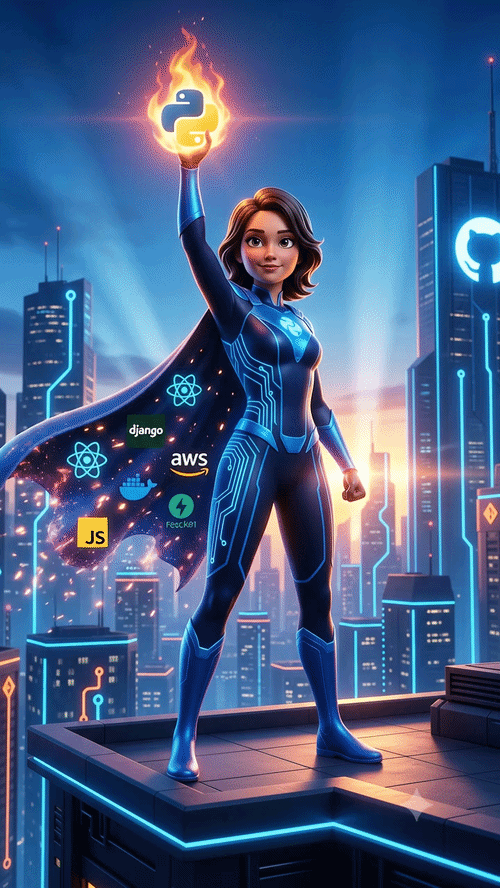

<div align="center">

# 👋 Hi, I'm Muskan Jha

### Software Engineer • Java Full Stack Developer • AI & Machine Learning Enthusiast

### Building Intelligent Applications, Scalable Systems & AI-Powered Solutions



<br>


<br><br>

<a href="mailto:muskanjha92002@gmail.com">

</a>

<a href="https://github.com/paranoid-us">

</a>

<a href="#">

</a>

<a href="#">

</a>


</div>

---

# 🚀 About Me

```yaml
Name: Muskan Jha

Education:
  Degree: Master of Computer Applications (MCA)
  Institution: Chandigarh Group of Colleges
  CGPA: 8.4

Current Role:
  Java Full Stack Developer Intern @ Mphasis

Areas of Interest:
  - Software Engineering
  - Artificial Intelligence
  - Machine Learning
  - NLP
  - Full Stack Development
  - Data Analytics
  - System Design

Currently Learning:
  - Microservices Architecture
  - Cloud Technologies
  - AI Engineering
  - Advanced Backend Development

Open To:
  - Software Engineering Roles
  - Full Stack Development Opportunities
  - AI/ML Projects
  - Open Source Contributions
```

---

## 💼 What I'm Working On

🔹 Building scalable backend systems using Java & Spring Boot

🔹 Developing AI-powered applications using NLP and Machine Learning

🔹 Strengthening Data Engineering and Database concepts

🔹 Exploring System Design and Software Architecture

🔹 Creating production-ready full-stack applications

🔹 Continuously learning modern development practices

---

# 🛠️ Tech Arsenal

## Languages

<p align="center">

</p>

---

## Backend Development

<p align="center">

</p>

---

## Frontend Development

<p align="center">

</p>

---

## AI / Machine Learning

<p align="center">


</p>

---

## Databases

<p align="center">

</p>

---

## Tools & Platforms

<p align="center">

</p>

---

# 🌟 Featured Projects

## 📂 TradeNest

Enterprise-grade file management and automation platform designed to streamline file organization, categorization, and workflow management.

### Highlights

✨ Automated file categorization

✨ Intelligent file organization

✨ Version-controlled architecture

✨ Reduced manual effort by 40%

**Tech Stack**

`Python` • `Git` • `Automation` • `File Management`

---

## 🏷️ AutoTagging Tool

Machine Learning-based text analysis platform that automatically generates tags from unstructured textual content using NLP techniques.

### Highlights

✨ TF-IDF based keyword extraction

✨ Intelligent tag generation

✨ Automated classification

✨ Reduced manual tagging effort

**Tech Stack**

`Python` • `Scikit-Learn` • `Pandas` • `NLP`

---

## 🩺 HopeDose

AI-powered healthcare assistant delivering personalized medication reminders and wellness recommendations.

### Highlights

✨ NLP-powered conversations

✨ Intent classification

✨ Personalized recommendations

✨ Responsive web application

**Tech Stack**

`Python` • `HTML` • `CSS` • `JavaScript` • `NLP`

---

# 📊 GitHub Analytics

<div align="center">


</div>

<br>

<div align="center">


</div>

<br>

<div align="center">


</div>

---

# 📈 Contribution Activity

<div align="center">


</div>

---

# 💬 Ask Me About

```text
Java & Spring Boot
Python Development
Machine Learning
Natural Language Processing
React Development
REST APIs
Database Design
Git & GitHub
Data Analytics
Power BI
Software Engineering
```

---

# 🏆 Achievements

🥇 Java Full Stack Developer Intern @ Mphasis

🚀 Built AI-powered projects involving NLP & Machine Learning

🏆 Developed multiple end-to-end software applications

💡 Passionate about solving real-world problems using technology

📚 Continuous learner with strong analytical thinking

---

# 🎯 2026 Goals

✅ Secure a Software Engineer Role

✅ Master Backend Architecture

✅ Become Proficient in System Design

✅ Build Production-Grade AI Applications

✅ Strengthen Cloud & DevOps Skills

✅ Contribute to Open Source

✅ Publish High-Quality Technical Projects

✅ Continue Learning & Growing Every Day

---

# 🤝 Let's Connect

<div align="center">

### Open for Collaborations • Internships • Full-Time Opportunities

<a href="mailto:muskanjha92002@gmail.com">

</a>

<br><br>

### ⭐ Turning Ideas Into Impactful Software Solutions


</div>
